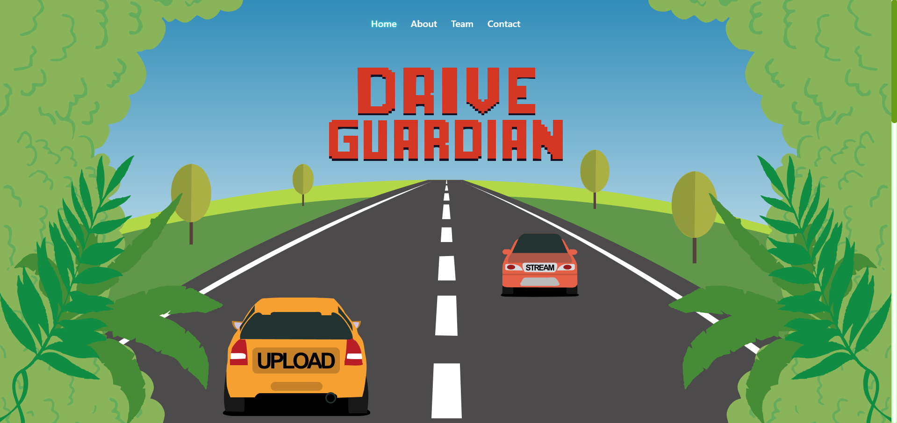
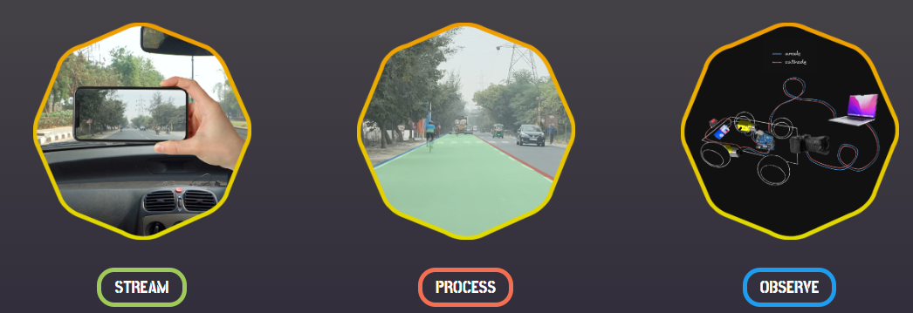
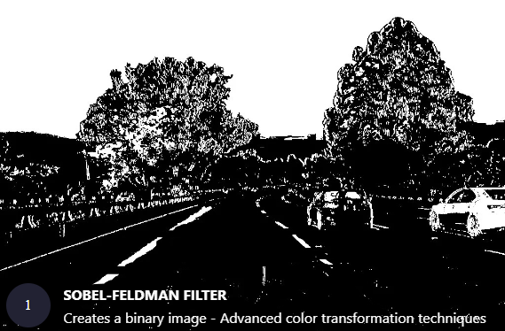

# Drive Guardian 🚗: Automatic Breaking Assistant



## ⭐⭐ Project Showcase at Hackaccino 2024, Bennett University


Developed by [Rohan Pandey](https://github.com/rohan-pandeyy) and [Dhruv Kumar](https://github.com/DhruvK278)

### Video Demo

https://github.com/user-attachments/assets/e4e4497d-8dad-4fd3-b93a-3001a7c23c59

## Table of Contents
- [Background](#background)
- [Features](#features)
- [ML Algorithm](#ml-algorithm)
- [Instructions to Run](#instructions-to-run)
- [Requirements](#requirements)
- [Description of Project](#description-of-project)
- [Contributions and Acknowledgments](#contributions-and-acknowledgments)

## Background
With the increasing number of road accidents, Drive Guardian aims to enhance driver safety by providing a tool that automatically applies brakes when necessary. Our application leverages advanced machine learning algorithms, such as YOLO and lane detection, to ensure precise brake timing, reducing the risk of accidents.
 
## Description of Project
Our project aims to enhance the safety of drivers and passengers alike by leveraging live feeds from dashcam videos and utilizing advanced algorithms for real-time analysis of applying brakes.

## Features
- Real-time Analysis: Our system provides sophisticated real-time analysis of road conditions, continuously monitoring for potential hazards.
- Object Detection and Prediction: Utilizing advanced algorithms, we detect objects and predict potential hazards, empowering drivers with proactive insights.
- Enhanced Video Clarity: Through seamless integration of upscaling techniques, we enhance the clarity and accuracy of the video feed for precise analysis.

  


## ML Algorithm



### Input
User-provided dashcam video or stream with their device.

### Data Preprocessing
- Camera Calibration: Removes lens distortion using cv2.undistort() and calibration data.
- Lane Feature Enhancement:
    - Gradient Thresholding: Highlights edges using abs_sobel_thresh().
    - Color Thresholding: Selects lane-like pixels based on color with color_threshold().
    - Bird's-Eye View: Transforms image for easier lane detection via cv2.warpPerspective().
- YOLOv5 Input: Likely handled internally, involving resizing and normalization.

### Object and Lane Analysis Techniques
- Utilized advanced Computer Vision techniques, including YOLO and machine learning models.
- Developed an ML model to detect lane and object detection.
- Leveraged CV models from `Github` to achieve exceptional accuracy in sentiment classification.
- Utilized `YOLO` and Sobel algorithm (CV model) for vehicle detection and lane detection.


### Output
Detects vehicle and lanes to apply emergency brakes.


## Instructions to Run
To run this project locally, follow these steps:
you must have flask to run it on your local machine, then run it on localhost.

- Install Requirements
```pip install ultralytics```

- Run the application
```flask run```

## Requirements
```
flask
opencv-python==4.9.0.80  
numpy==1.24.3  
torch==2.2.2 
pillow==10.3.0
pandas
numpy
nltk
scikit-learn
cuda
matplotlib
plotly==5.17.0
pygwalker==0.4.8
scipy==1.13.0
transformers==4.33.2
torch==2.2.2
torchvision
```

## Contributions and Acknowledgments
This project is open for contributions, and we welcome any feedback or suggestions for improvement. If you find this project useful, feel free to use it for your needs. When attributing this project, please mention:
```
Drive Guardian by Rohan Pandey & Dhruv Kumar
Repository: https://github.com/rohan-pandeyy/drive-guardian
```
